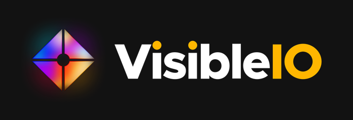
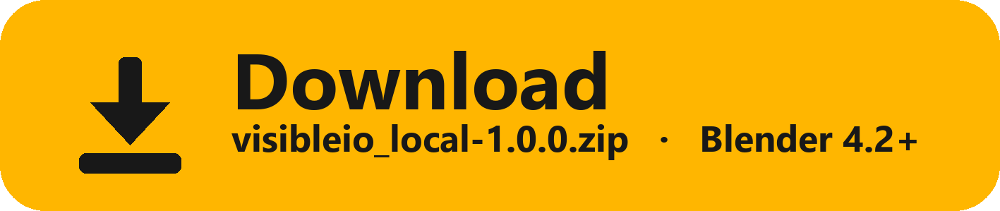
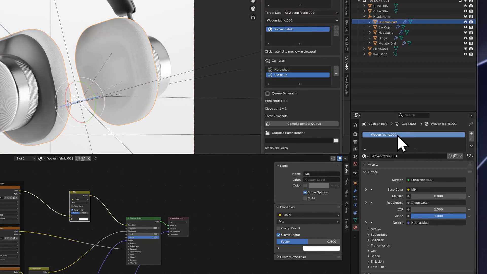
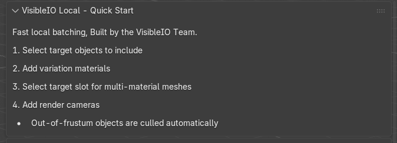
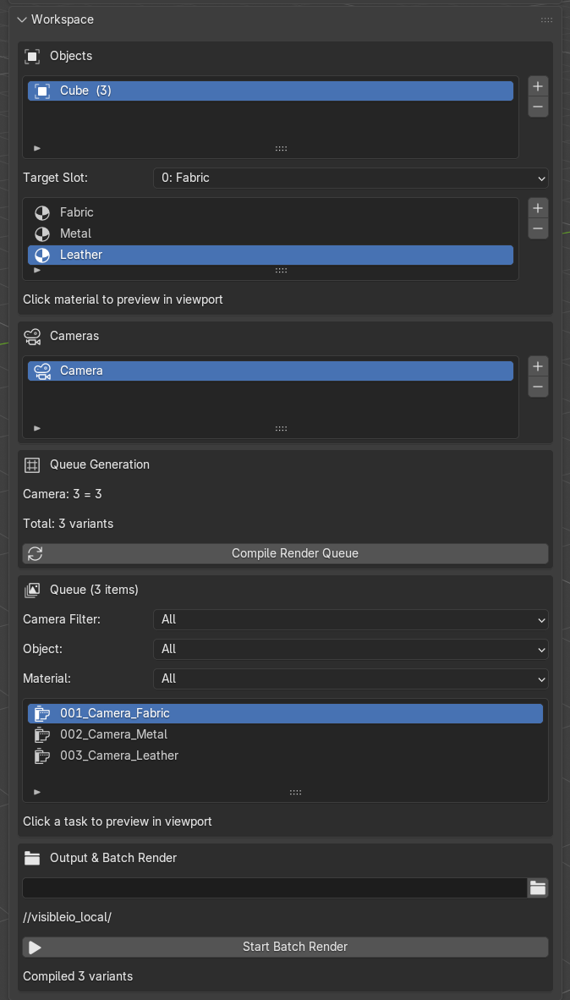

# VisibleIO Local — Offline Blender Material Configurator

  

VisibleIO Local is an offline Blender extension. It builds material combinations for the objects you select and saves each combination as a PNG on your computer. It does not connect to the internet, ask you to sign in, or upload files.

Use it when a product needs many material options and each option should be a still image next to the `.blend` file.

  

Install that file in Blender. Do not install the archive from GitHub’s **Code → Download ZIP**. That archive is this source folder, and Blender will not load it as an extension.

  
   
  <a href="VisibleIO_local_demo.mp4">Play the demo</a>

  

  

Website: [https://visibleio.com](https://visibleio.com)

## Install

Requires Blender 4.2 or newer.

1. Download [visibleio_local-1.0.0.zip](https://github.com/VisibleIO/blender-material-configurator/raw/main/visibleio_local-1.0.0.zip).
2. In Blender, open **Edit → Preferences → Extensions → Install from Disk** and choose that zip.
3. Enable **VisibleIO Local**.
4. In the 3D Viewport, press `N` and open the **VisibleIO** tab.

The add-on asks for the **files** permission so it can write PNG stills into the output folder. It does not request a network permission.

## What it does

Two sections sit in the VisibleIO tab. **VisibleIO Local - Quick Start** is the short guide. **Workspace** is where you build and render.

You choose objects, the target material slot, and the materials to combine. You then add one or more cameras. **Compile Render Queue** writes one variant for every material combination inside each camera’s view. **Start Batch Render** opens Blender’s render window and writes one PNG per variant.

Objects outside a camera’s view are left out of that camera. Only the target slot is combined. Secondary slots follow the material you picked for that combination, so they do not multiply the number of variants.

## How to use it

1. Select one or more objects that have material slots, then click **+** next to Objects.
2. Choose **Target Slot**, and add the materials for that slot. Click a material to preview it in the viewport.
3. If the object has other slots, set **Secondary Slots** for the selected material. Those slots do not add variants.
4. Add one or more cameras. Objects outside a camera’s view are excluded from that camera.
5. Click **Compile Render Queue**. The add-on lists every variant and previews the first one.
6. Click a task in the queue to preview it. Filter the list by camera, object, or material when you only want to inspect some tasks.
7. Set the output folder, or leave it empty to save PNGs beside the `.blend` file in a `visibleio_local` folder.
8. Click **Start Batch Render**. This renders every compiled variant, including tasks hidden by the filter. Press `Esc` in the render window to cancel the batch.

Save the `.blend` file before rendering if the output folder is empty. An unsaved file has no folder beside it, so the add-on asks you to save or to set an output folder.

The queue is stored in the `.blend` file. If you move a camera, change an object, or edit the materials, click **Compile Render Queue** again before rendering.

## Limits

- Up to 10,000 variants can be compiled at once.
- A missing material stops that render and does not write a PNG for it.
- Objects that share the same mesh data show the same preview material until the original materials are restored.

## Languages

The interface can follow Blender’s language setting. Turn on **Preferences → Interface → Translation → Interface**.

Supported languages: English, Traditional Chinese, Simplified Chinese, Japanese, Korean, German, French, Spanish, Brazilian Portuguese, Indonesian, Vietnamese, and Thai.

## Frequently asked questions

### What is VisibleIO Local?

VisibleIO Local is the offline Blender Material Configurator. It sets material combinations on the objects you choose and renders each combination to a PNG on your computer.

### Does VisibleIO Local need an account?

No. It runs inside Blender and does not sign in to a website.

### Does it upload renders?

No. PNG files are written only to the output folder you choose, or to `visibleio_local` next to the saved `.blend` file.

### Which file do I install?

Install [visibleio_local-1.0.0.zip](https://github.com/VisibleIO/blender-material-configurator/raw/main/visibleio_local-1.0.0.zip) from **Edit → Preferences → Extensions → Install from Disk**. The zip from GitHub’s **Code → Download ZIP** is the source folder, not the extension package.

### Which Blender versions work?

Blender 4.2 and newer. The package is a Blender extension, id `visibleio_local`, version 1.0.0, with `blender_manifest.toml`.

### How are combinations counted?

Each camera is counted on its own. For one camera, the count is the product of the materials on the target slot of each object inside that camera’s view. Secondary slots follow the chosen material and are not extra combinations. The total is the sum of every camera.

### Why is an object missing from a camera?

The object is outside that camera’s view. Only objects you added are tested. An object is included when any corner of its bounding box is inside the camera view.

### Where are the PNG files saved?

In the output folder. If that folder is empty and the `.blend` file is saved, the files go in a `visibleio_local` folder next to the `.blend` file. Each file is named from the task and the camera.

### Does the queue filter change what Start Batch Render renders?

No. The camera, object, and material filters only change which tasks are shown. **Start Batch Render** renders every compiled variant.

### What license is the add-on?

The Python code is [GPL-3.0-or-later](https://spdx.org/licenses/GPL-3.0-or-later.html). Source files carry an SPDX header, and the full license text is in `LICENSE`. The extension icon, `icon.png`, is [CC0-1.0](https://spdx.org/licenses/CC0-1.0.html).

## Files in this folder

| File | Purpose |
| --- | --- |
| `visibleio_local-1.0.0.zip` | Extension to install in Blender. Five files at the archive root |
| `__init__.py` | Add-on operators, queue, preview, and render |
| `translations.py` | Interface translations |
| `blender_manifest.toml` | Blender extension manifest, version 1.0.0 |
| `icon.png` | Extension icon, 256×256 PNG, CC0-1.0 |
| `VisibleIO_local_demo.mp4` | Product demo, 1080p |
| `screenshots/demo-poster.png` | Still frame that links to the demo |
| `LICENSE` | GPL-3.0-or-later license text |
| `visibleio-logo-on-dark.png` | README logo |
| `download.png` | Download button on this page |
| `README.md` | This page |
